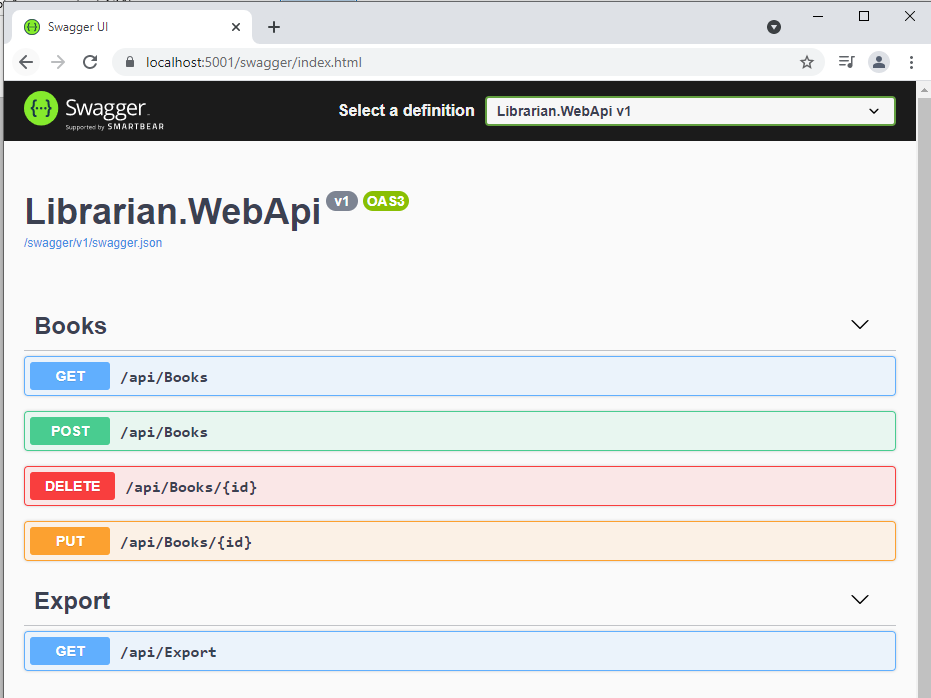
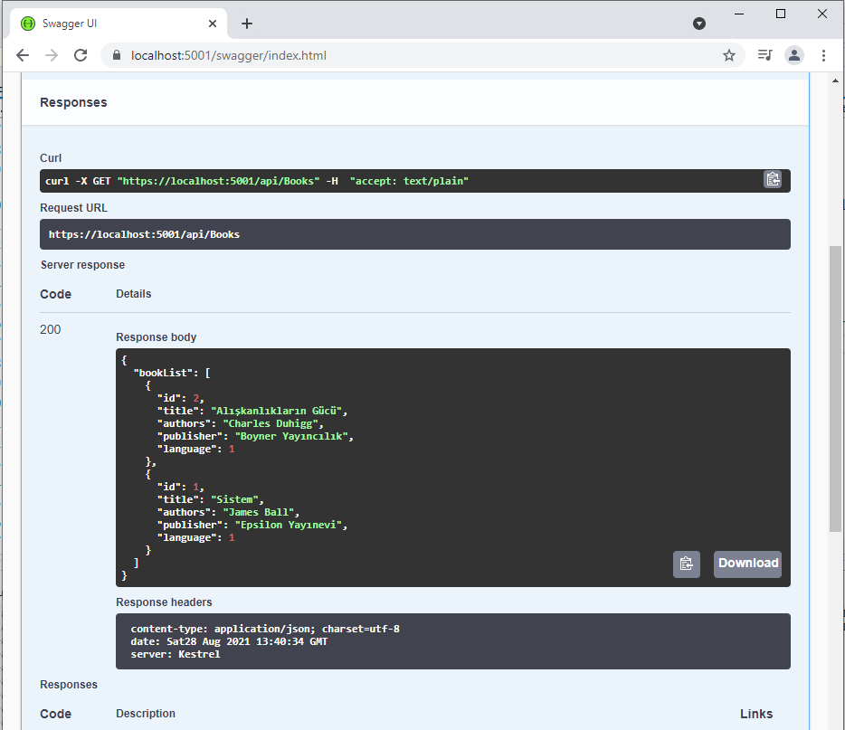
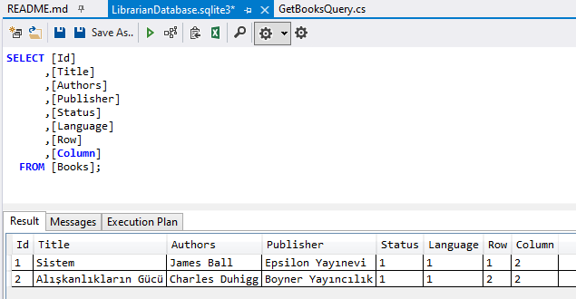
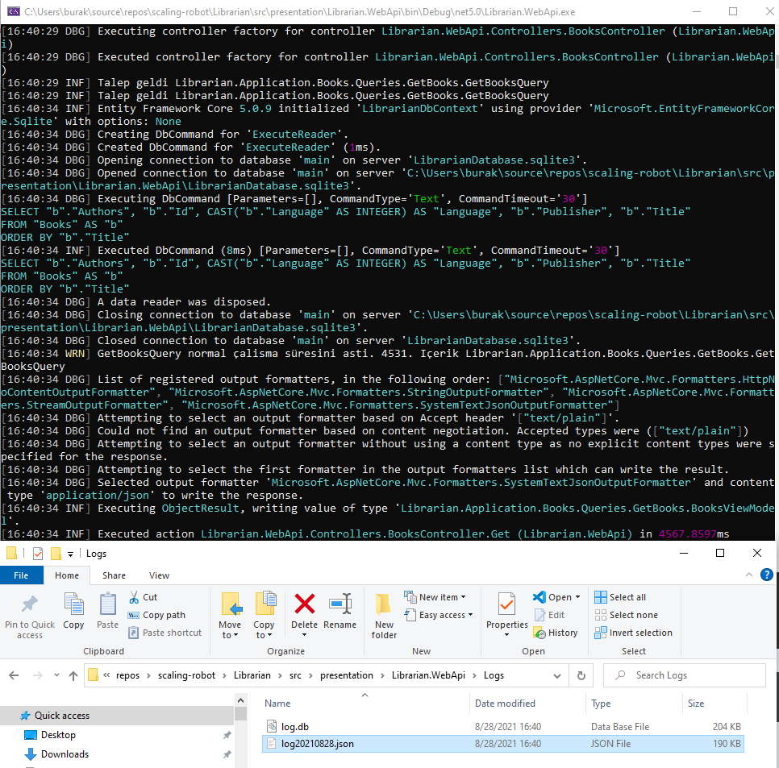
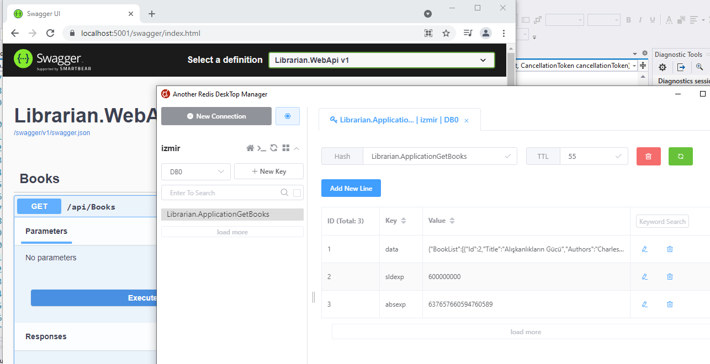

# Scaling-Robot (Bir Clean Architecture Macerası)

Clean Architecture'ın basit uygulamalı bir örneğini yapmaya çalışacağım. Asp.Net Core üstünde ilerlemeyi düşünüyorum. .Net 5 tabanlı olmasına özen göstereceğim. Frontend tarafta React veya Vue.Js kullanabilirim. Fikir olarak çok sıradan ama bilindik bir senaryo üstünde ilerleyebilirim. Çalışma odamdaki kitapların sayısı arttı ve hangi kitap hangi rafta bulmakta zorlanıyorum. Kitaplığımı kayıt altına alacağım basit bir uygulama geliştirebilirim. Scaling-Robot isminin kitaplıkla bir ilgisi yok. Github önerdi, hoşuma gitti ;)

__Takip edilen kaynak : Asp.Net Core and Vue.js, Build read-world, scalable, full-stack applications using vue.js 3, Typescript, .NET 5, and Azure, Devlin Basilan Duldulao, Packt__

## Taslak Plan

- [x] Gün 00 - Proje iskeletinin oluşturulması, EF kurulumu ve SQlite migration işleri
- [x] Gün 01 - MediatR Eklenmesi ve Temel Behavior tipleri ile bazı servis sözleşmelerinin oluşturulması
- [x] Gün 02 - AutoMapper ve CSV Export Özelliğinin Kazandırılması
- [x] Gün 03 - İlk Query Tiplerinin(ExportBooksQuery, GetBooksQuery) Yazılması
- [x] Gün 04 - Kitap Oluşturma, Güncelleme ve Silme operasyonlarına ait Command Nesnelerinin Oluşturulması
- [x] Gün 05 - Dependency Injection yürütücü, Mail gönderici ve CSV dosya üretici sınıflarının yazılması.
- [x] Gün 06 - Web API Projesindeki Controller'ların Tamamlanması ve Diğer
- [x] Gün 07 - Serilog Entegrasyonu ve Yapısal Log'lamaya Geçiş
- [x] Gün 08 - Cache Yapısının Kurgulanması ve Redis Entegrasyonu
- [ ] Gün 09 - JWT Bazlı Güvenlik Politikasının Eklenmesi
- [ ] Gün 10 - Önyüz Uygulamasının Vue.js ile Geliştirilmesi

## Çalışma Logları

Projede ilerledikçe neler yaptığımı gün bazında kayıt altına almak iyi bir fikir olabilir.

## Gün 0 - Proje iskeletinin oluşturulması, EF kurulumu ve SQlite migration işleri

Core, Infrastructure ve Presentation katmanlarını içeren Solution ağacı ile temel projelerin oluşturulması.

```bash
mkdir Librarian
cd Librarian

dotnet new sln

mkdir src
cd src

mkdir core
mkdir infrastructure
mkdir presentation

cd core
dotnet new classlib -f netstandard2.1 --name Librarian.Domain
dotnet new classlib -f netstandard2.1 --name Librarian.Application

cd Librarian.Application
dotnet add reference ..\Librarian.Domain\Librarian.Domain.csproj

cd ..
cd ..
cd infrastructure

dotnet new classlib -f net5.0 --name Librarian.Data
dotnet new classlib -f net5.0 --name Librarian.Shared

cd Librarian.Data
dotnet add reference ..\..\core\Librarian.Domain\Librarian.Domain.csproj
dotnet add reference ..\..\core\Librarian.Application\Librarian.Application.csproj

cd ..
cd Librarian.Shared
dotnet add reference ..\..\core\Librarian.Application\Librarian.Application.csproj

cd ..
cd ..
cd presentation

dotnet new webapi --name Librarian.WebApi

cd Librarian.WebApi

dotnet add reference ..\..\core\Librarian.Application\Librarian.Application.csproj
dotnet add reference ..\..\infrastructure\Librarian.Data\Librarian.Data.csproj
dotnet add reference ..\..\infrastructure\Librarian.Shared\Librarian.Shared.csproj

cd ..
cd ..
cd ..

dotnet sln add src/core/Librarian.Domain/Librarian.Domain.csproj
dotnet sln add src/core/Librarian.Application/Librarian.Application.csproj
dotnet sln add src/infrastructure/Librarian.Data/Librarian.Data.csproj
dotnet sln add src/infrastructure/Librarian.Shared/Librarian.Shared.csproj
dotnet sln add src/presentation/Librarian.WebApi/Librarian.WebApi.csproj
```

İskelet kabaca şöyle;

- __core__
  - Librarian.Application _(Domain projesini kullanır)_
  - Librarian.Domain
- __infrastructure__
  - Librarian.Data _(Application ve Domain projelerini kullanır)_
  - Librarian.Shared _(Application projesini kullanır)_
- __presentation__
  - Librarian.WebApi _(Application, Data ve Shared projelerini kullanır)_

```bash
# Domain projesine entity ve enum tipleri ekleniyor
cd src
cd core
cd Librarian.Domain
mkdir Entities
mkdir Enums
cd ..
cd ..

# Entity Framework için gerekli hazırlıklar

dotnet tool install --global dotnet-ef

cd presentation
cd Librarian.WebApi

dotnet add package Microsoft.EntityFrameworkCore.Design

cd ..
cd ..
cd infrastructure
cd Librarian.Data
dotnet add package Microsoft.EntityFrameworkCore.Sqlite

mkdir Contexts

# Sqlite veri tabanı için migration operasyonları

dotnet ef migrations add InitialCreate --startup-project ..\..\presentation\Librarian.WebApi
dotnet ef database update --startup-project ..\..\presentation\Librarian.WebApi
```
## Gün 1 - MediatR Eklenmesi ve Temel Behavior tipleri ile bazı servis sözleşmelerinin oluşturulması

Yavaştan CQRS tarafında önemli görevi olan ve contoller taleplerini doğru command/query nesnelerine yönlendirecek MediatR paketi ile ilgili geliştirmelere başlıyorum.
MediatR katmanında request,handler,response üçgeninde araya girmemizi sağlayan Behavior türevlerinin nasıl kullanıldığını anlamaya çalışıyorum. Talebin ömrü belli bir sınırın üstündeyse uyarı logu atan bir tanesi, çeşitli doğrulama kriterlerini yakalayıp ihlaller için exception toplayan bir diğeri vs

```bash
# MediatR, DependencyInjection ve Log paketlerinin eklenmesi
cd ..
cd ..
cd core
cd Librarian.Application
dotnet add package MediatR
dotnet add package MediatR.Extensions.Microsoft.DependencyInjection
dotnet add package Microsoft.Extensions.Logging.Abstractions
mkdir Common
cd Common
mkdir Behaviors
```

- MediatR üstünden kullanılabilecek farklı davranışlar eklendi. Özellikle request ve handler arasına girilen yerlere eklendiler. Loglama, performans ölçücü, exception kovalayıcı, içerik doğrulayıcı.
- Mesaj doğrulama kısmında çalışacak ValidationBehavior davranışı için FluentValidation paketi eklendi
- Doğrulama ihlalleri için Common altına Exception klasörü açılıp ValidationException sınıfı eklendi. 

```bash
dotnet add package FluentValidation
FluentValidation.DependencyInjectionExtensions

# Uygulama katmanında EF için bir sözleşme ekleyeceğiz. Öncesinde EF Core paketini
# Librarian.Application projesine ekliyoruz
dotnet add package Microsoft.EntityFrameworkCore
```

Librarian.Application içindeki Common altına Interfaces isimli bir klasör oluşturup içine EF sözleşmesini eklendi. Burada uygulama seviyesindeki hizmetler için servis sözleşmelerini toplayabiliriz. Örneğin email gönderme hizmeti.

EmailService sözleşmesi mail gönderme işini üstlenirken mail bilgisi için Dtos/Email klasöründeki EmailDto sınıfını kullanıyor. Bu nedenle,

```bash
# Librarian.Application projesinde iken aşağıdaki klasör yapısı oluşturuldu.
mkdir Dtos
cd Dtos
mkdir Email

# Sonrasında önce EmailDto isimli Data Transfer Object sınıfı, sonrasında IEmailServise sözleşme sınıfı yazıldı.
```

## Gün 2 - AutoMapper ve CSV Export Özelliğinin Kazandırılması

Kitap listesinin CSV olarak exprot edilmesini istediğimizi düşünelim. Book'un bazı alanlarını taşıyan ayrı bir nesne, çıktı için bir ViewModel tasarlanıyor. Aralardaki nesneden nesneye dönüşümlerde AutoMapper kullanılıyor.

```bash
# Librarian.Application projesine AutoMapper paketi eklenir.

dotnet add package AutoMapper
dotnet add package AutoMapper.Extensions.Microsoft.DependencyInjection
```

Bunu takiben Common altına Mappings isimli bir klasör açıldı ve MappingProfile sınıfı ile IMapFrom sözleşmesi eklendi. _(Bunların nereden işe yarayacağını kitabın ilerleyen kısımlarından anlayacağım sanırım)_

```bash
# Librarian.Application klasöründeyken
mkdir Books
cd Books
mkdir Commands
mkdir Queries
cd Queries
mkdir ExportBooks
mkdir GetBooks
```

- ExportBooks klasörüne gidildi ve BookRecord ile ExportBooksViewModel isimli sınıflar eklendi. 
- Ayrıca CSV dosya çıktısı için ICsvBuilder isimli bir servis sözleşmesi Common/Interfaces klasörüne eklendi.

## Gün 3 - İlk Query Tiplerinin(ExportBooksQuery, GetBooksQuery) Yazılması

Librarian.Application üstünde ilk Query tipini yazmaya başladım.

- Dtos altına Books isimli bir klasör açıp içine BookDto sınıfı eklendi.
- Aynı projenin Queries/ExportBooks klasörü altına ExportBooksQuery ve ExportBooksQueryHandler isimli sınıflar eklendi. Kitap listesini CSV'te export eden Query ve Handler tipleri.
- Kitap listesini çekmek için gerekli GetBooksQuery ve GetBooksQueryHandler isimli Query sınıfları eklendi. 
- Her iki Query Handler tipi de çevrilen DTO nesne listelerini birer ViewModel içerisinde kullanıp geri veriyor. _CSV çıktısı ile ilgili olan ExportBooksViewModel, kitap listesinin çekmek ile ilgili olan da BooksViewModel_

QueryHandler tipleri ViewModel nesneleri döndürüyor. Book tipinin tüm özelliklerini döndürmüyoruz veya dönüştürerek döndürdüğümüz özellikleri var. Bu nedenle ViewModel'ler içerisinde DTO nesneleri kullanılıyor. Handler sınıflarının Execute fonksiyonlarında EF Context üstünden gelen Book tipinin Mapper üzerinden ilgili DTO'lara çevrimi söz konusu.

## Gün 4 - Kitap Oluşturma, Güncelleme ve Silme operasyonlarına ait Command Nesnelerinin Oluşturulması

Bunun için Librarian.Application projesindeki Books/Commands klasöründe çalışacağız. Her komut için birer alt klasör açarak ilerlemek lazım.

```bash
mkdir CreateBook
mkdir UpdateBook
mkdir DeleteBook
```

- Kitap oluşturma işini üstlenen CreateBookCommand ve Handler sınıfı eklendi.
- Kitap oluşturma işi sırasında doğrulama işini üstlenen CreateBookCommandValidator sınıfı eklendi.
- Kitap bilgilerini güncelleme işini üstlenen UpdateBookCommand ve Handler sınıfı eklendi.
- Kitap güncellerken de doğrulama işlemleri gerekiyor. Bunun için de UpdateBookCommandValidator sınıfı ilave edildi.
- Güncelleme sırasında aranan kitap bulunamadığında ortama BookNotFoundException istisnası fırlatılmak istendiğinden Common/Exceptions altına da bu sınıf eklendi.
- Envanterden kitap silmek için kullanılacak olan DeleteBookCommand ve Handler tipi eklendi.

## Gün 5 - Dependency Injection yürütücü, Mail gönderici ve CSV dosya üretici sınıflarının yazılması.

- Librarian.Application projesi için bir dependency injection sınıfı eklendi.
- Librarian.Shared projesine Services isimli klasör açıldı ve içine CsvBuilder, EmailService sınıfları eklendi. 
- Mail gönderimi sırasından From ve DisplayName gibi kısımları çalışma zamanının sahibi uygulamadan almamız gerekebilir. Bu nedenle appSettings için MailSettings isimli bir sınıf Librarian.Domain projesindeki Settings klasörü altına eklendi. 
 
CsvBuilder için yardımcı CsvHelper, EmailService içinde MailKit ve MimeKit paketlerini Infrastructure katmanındaki Librarian.Shared projesine

```bash
dotnet add package CsvHelper
dotnet add package MailKit
dotnet add package MimeKit

# tabii birde Dependency Injection tarafı için yine Librarian.Shared projesine aşağıdaki paketi ekliyoruz.
dotnet add package Microsoft.Extensions.Options.ConfigurationExtensions
```

Servisler eklendikten sonra pek tabii bunları tüketecek uygulama kimse onun DI servislerine yardımcı olması için aynen Application projesinde olduğu gibi DependencyInjection isimli bir sınıfı Shared projesine de ekliyoruz.

__Bu arada şu ana kadar yazdığımız servisler çalışıyor mu hiç test etmedim. Keşke Unit Test'leri yazark ilerleseydim dediğim noktadayım :|__

## Gün 6 - Web API Projesindeki Controller'ların Tamamlanması ve Diğer

- Presentation katmanındaki Librarian.WebApi projesinde bulunan BooksController sınıfı, MediatR ve doğal olarak CQRS kullanır hale getirildi.
- Startup.cs içerisinde Core katmanındaki Application ve ve Infrastructure katmanındaki Shared kütüphanelerinde tanımladığımız Dependency Injection metotları konuşlandırıldı.
- Mail ayarları için appSettings.json dosyasında MailSettings alanı açıldı ve özellikleri eklendi.
- Entity Framework Context'inin ele alındığı Infrastructure.Data propjesine de Dependency Injection ayarları için sınıf eklendi.
- Kısa bir test yapılıp Swagger arabirimi üstünden yeni bir kitap eklenip listesi çekildi.
- CSV Export işlemi için WebApi tarafına ExportController sınıfı eklendi.

Sonrasında uygulamayı çalıştırıp Swagger arabirimi üstünden birkaç test yapılabilir. Birkaç kitap eklenip listesi çekilmeye çalışışabilir.







## Gün 7 - Serilog Entegrasyonu ve Yapısal Log'lamaya Geçiş

Logları yapısal (structured) tutmak için Web API tarafında ekler yapıldı.

```bash
# Gerekli Nuget paketleri yüklenir
dotnet add package Serilog.AspNetCore
dotnet add package Serilog.Settings.Configuration
dotnet add package Serilog.Exceptions
dotnet add package Serilog.Formatting.Compact
dotnet add package Serilog.Enrichers.Environment
dotnet add package Serilog.Enrichers.Process
dotnet add package Serilog.Enrichers.Thread
dotnet add package Serilog.Sinks.File
dotnet add package Serilog.Sinks.SQLite
```

- Librarian.WebApi, Program.cs içerisindeki Main metoduna loglama için gerekli kodlar eklendi.

Log mekanizması eklendikten sonra uygulamayı çalıştırıp Swagger ile birkaç test yapıldığında Logs klasör altındaki SQLite ve JSON dosya içeriklerinin log kayıtları ile doldurulduğunun görülmesi lazım.



## Gün 8 - Cache Yapısının Kurgulanması ve Redis Entegrasyonu

In-Memory cache yerine kitabın da anlattığı üzere dağıtık cache sistemlerinden redis'i kullanmayı tercih ettim. Sistem redis kurmayacağım ancak docker imajından yararlanabilirm.

```bash
docker run --name izmir -p 6379:6379 -d redis

#Container'ı çalıştırdıktan sonra Docker Desktop üstünden terminal ekranını açıp izleyen komutu vermekte yarar var.
redis-cli ping

# Bize PONG cevabı dönmeli

# Core katmanındaki Librarian.Application projesine redis kullanımı için gerekli Nuget paketleri yüklenir.
dotnet add package Microsoft.Extensions.Caching.StackExchangeRedis
dotnet add package Microsoft.Extensions.Configuration

# Cache için JSON serileştirmesi kullanabiliriz
dotnet add package Newtonsoft.Json
```

- Redis servislerinin DI tarafına dahil edilmesi için Librarian.Application projesindeki DependencyInjection sınıfında gerekli düzenlemeler yapıldı.
- Web Api projesinin appSettings.json dosyasına Redis sunucu adresi eklendi.
- Core katmanındaki Librarian.Application projesindeki GetBooksQueryHandler sınıfında cache stratejisi uygulandı.

Redis ayarları yapıldıktan sonra uygulamayı debug modda çalıştırıp incelemekte yarar var. İlk seferinde kitap listesini veri tabanından çekmeli, sonrakinde ise(belirlenen süre politikasına göre tabii) içeriği redis cache üstünden getirmeli.

__Kitap Redis içeriğini [Another Redis Desktop Manager](https://github.com/qishibo/AnotherRedisDesktopManager) isimli programla görebileceğimizi belirtmişti. Bende indirip denedim ve kullanışlı bir arabirimi olduğunu gördüm__



## Gün 9 - Genel API Testleri ve Kod Düzeltmeleri